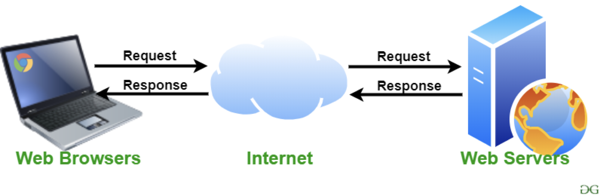
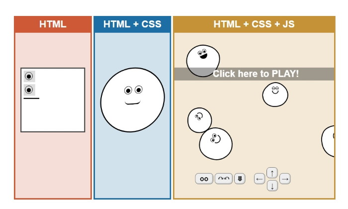
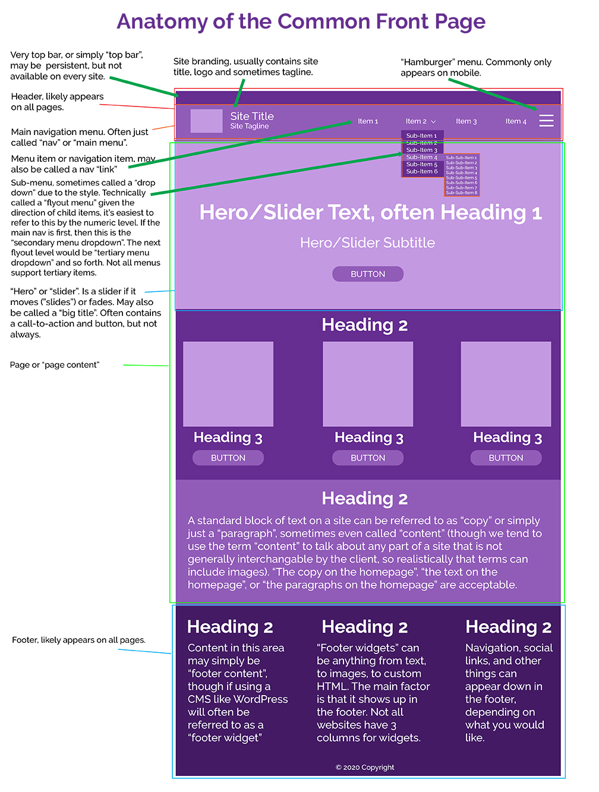
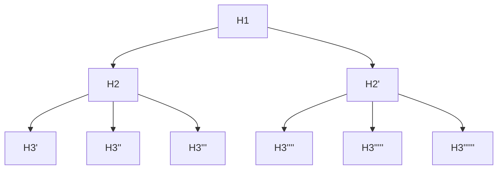
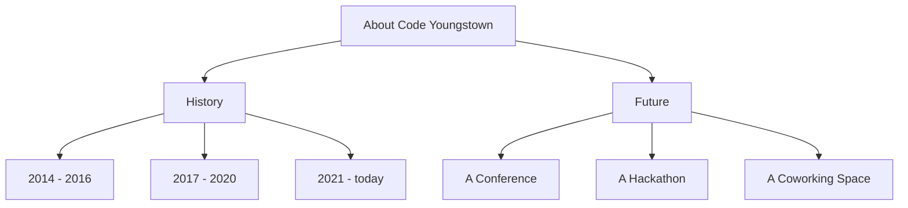
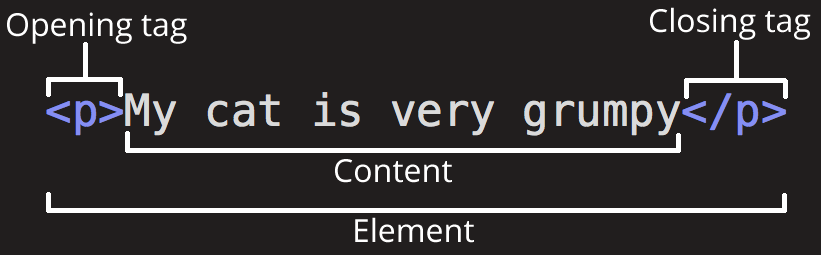
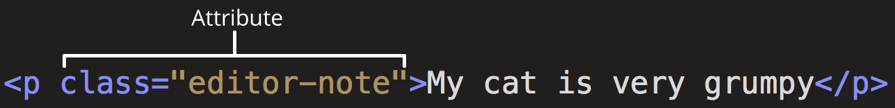
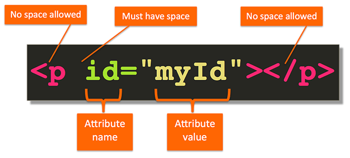
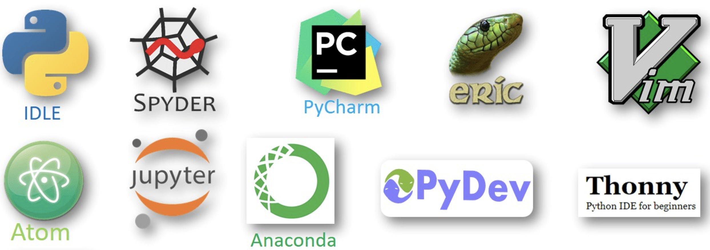
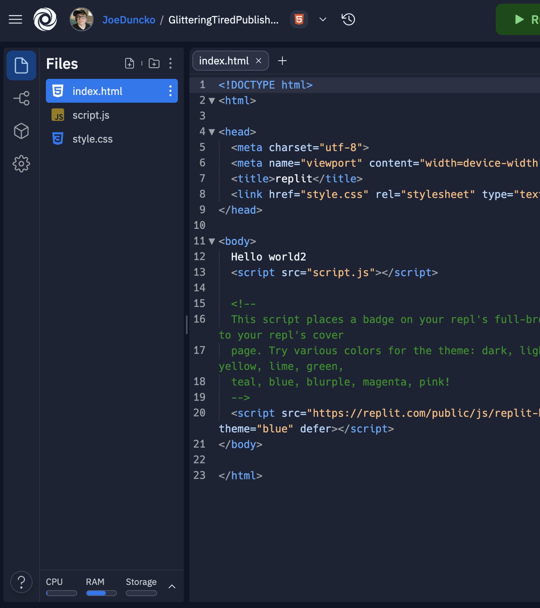

# Websites 101

Joe Duncko 2023-01-11

---

## We're going to build something today

We'll cover the "why"s later, for now, let's start with "how"s!

---

## No Student Support Hours tonight

I'll be at Code Mash!

Consider volunteering next year!


---

## How websites work



---

## What websites are made out of



---

## HTML

For content and layout

```html
<div class="pure-g centered">
  <div class="pure-u-1-1">
    <p>
      Connecting software engineers, developers, and coders in the Youngstown,
      OH area.
    </p>
    <p class="smaller">
      Join the ongoing chat via
      <a href="http://slack.codeyoungstown.com/">Slack</a> and attend our
      <a href="https://www.meetup.com/Code-Youngstown/">meetups</a>.
    </p>
  </div>
</div>
```

Example from previous CodeYoungstown.com iteration

---

## CSS

For positioning and styling

```css
body {
  background-color: #222322;
  color: #fff;
  padding: 1em;
}

p {
  font-family: "Open Sans", sans-serif;
  font-weight: 400;
  font-size: 24px;
  margin: 0 0 1em 0;
}

.content {
  margin-bottom: 2em;
}

.logo {
  max-width: 40%;
  min-width: 300px;
  margin-bottom: 1em;
}

.social {
  font-size: 42px;
}

a:link {
  color: #fff;
}
a:visited {
  color: #fff;
}
a:hover {
  color: #ccc;
}
a:active {
  color: #ccc;
}

/* utility */
.centered {
  text-align: center;
}
.smaller {
  font-size: 20px;
}
```

Example from previous CodeYoungstown.com iteration

---

## JavaScript

For interaction

```js
//add a link icon to the right of every link
//turn it blue when you mouse over the link text
$(function () {
  $("a").hover(
    function () {
      $(this).children(".fa-external-link").addClass("blue");
    },
    function () {
      $(this).children(".fa-external-link").removeClass("blue");
    }
  );

  $("a:not(.do-not-add-link-icon)").append(
    "<i class='fa fa-external-link hide-when-printing'></i>"
  );
});
```

Example from previous JoeDuncko.com iteration

---

# HTML 101

---

## Anatomy of a web site



---

## Hierarchy of headings



---

## Hierarchy of headings example



---

## The HTML Boilerplate

```html
<!DOCTYPE html>
<html lang="en">
  <head>
    <meta charset="UTF-8" />
    <meta name="viewport" content="width=device-width, initial-scale=1.0" />
    <title>HTML 5 Boilerplate</title>
  </head>

  <body>
    <!-- Content goes here -->
  </body>
</html>
```

---

## Anatomy of an HTML Element



---

## You can also have attributes on HTML Elements



---

## Common HTML Tags

- `<h1></h1>` - `<h6></h6>` for headers - `h1` is largest, `h6` is smallest
- `<p></p>` for paragraphs
- `<ul></ul>` for unordered lists
- `<ol></ol>` for ordered lists
- `<li></li>` for list items
- `<hr `/`>` for horizontal rules (lines)
- `<div></div>` for block divisions
- `<span></span>` for inline divisions

---

## Some notes on spacing HTML Elements


https://docs.sweeting.me/s/anatomy-of-html-css-js

---

# Let's see it in action! But first...

---

## How to write code




---

## Meet Replit

### How we'll be writing code

- Browser based
- Free
- Very similar to local environments
- Zero set up
- Collaboration features
- Education features
  - Submitting, feedback, etc



---

# Let's code!

---

## The W3C Nu Validator

Your new best friend

---

## That was basically Assignment 1

### Which is available NOW

See BlackBoard for Replit Team link

Due Wednesday Jan 18th by class time

---

## Resources

- I'll post the Replit link to the code we made today on BlackBoard
- Mozilla Developer Network (MDN)
  - Guides > HTML
- W3 Schools
  - Tutorials > Learn HTML

---

## Things not to do

- Rename or move `index.html` - it's a standardized default for the `/` page
- Not run the w3 Validator before you submit - I will literally run it when I grade
- Not submit the assignment - there's a big button at the top right in Replit

---

# Questions?

---

## One last thing...

---

## Let's publish to GitHub Pages

This is totally not course content, but what's the point of making web sites if you can't publish them?


