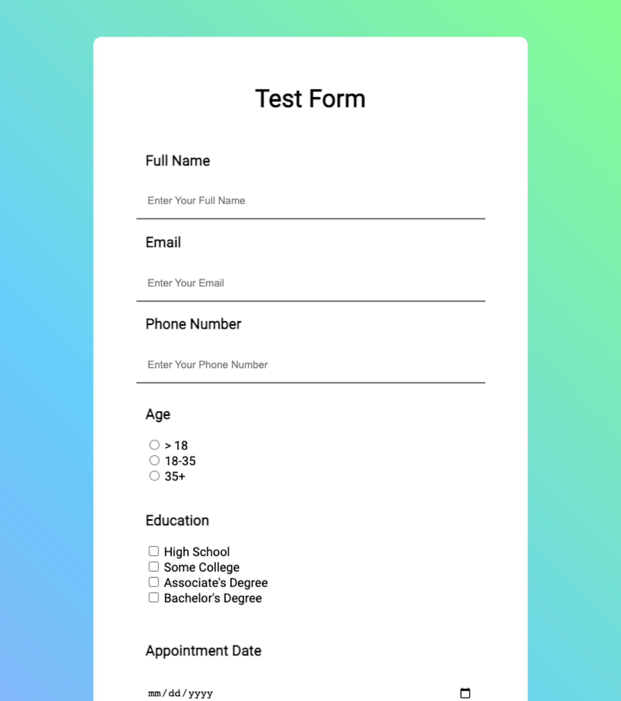
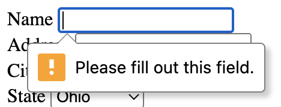
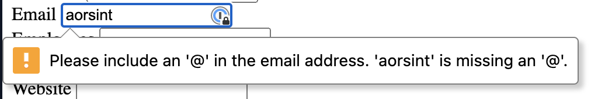

## HTML Forms

Joe Duncko 2023-01-16

---

## Last class we learned

- How websites work
- What HTML + CSS + JS look like
- Our first HTML tags
- What a text editor/IDE is
- How to use Replit
- How to build our first web site

---

## Assignment 1 was due by class time

### Any questions about assignment 1?

If you haven't turned it in, please do so ASAP
Feel free to stay after class if you have questions

---

## HTML Forms



---

## HTML Has Built-in Form Support

### It's, uh, okay for basic forms

- Several different form field types to choose from
- Can control how and where the form data is sent
  - It takes you to that page in the browser, though
- Basic client-side form validation
- Submit button "just works"
- Reset button "just works"

---

## Anatomy of an HTML Form

```html
<h1>What's your favorite book?</h1>

<form action="http://www.foo.com" method="POST">
  <div>
    <label for="title">Title</label>
    <input name="title" id="title" />
  </div>

  <div>
    <label for="author">Author</label>
    <input name="author" id="author" />
  </div>

  <div>
    <button type="submit">Submit</button>
    <button type="reset">Reset</button>
  </div>
</form>
```

---

## What's with all the attributes?

- `action` tells the form _where_ to send the form data
- `method` tells the form _how_ to format the form data when sending ("POST" is the standard way nowadays)
- `for` and `id` associate the label and the input for assistive technologies (screen readers, etc)
- `name` is the name of the property associated with the input value when sent to the server

---

## `type`s of HTML Form Fields

Defaults to `text`

- Text input
- Email input
- Password input
- Number input
- Date input
- Color input
- Phone input (need validator regex)
- Select (aka drop down) input
- File input (requires `enctype` attribute)
- Text Area input
- Radio button select
- Check box select
- - more

---

## What is validation?

- "Validation" is the practice of making sure inputs satisfy curtain requirements
  - For example, making sure someone doesn't put their age as their name or vice versa
- Good validation holds the user's hand and helps them fill out the form correctly, improving UX
- There are two kinds of validation:
  - "Client-side" validation happens before the user submits the form to the server
    - HTML Forms Inputs come with "basic" validation baked in, mostly tied to the input's `type`
    - Advanced validation can be done with JavaScript
    - Mostly for UX
  - "Server-side" validation
    - To protect against security vulnerabilities, all forms should also have server side validation
    - Verifies inputs can be put in the database in the expected way
    - Checks things the client cannot (is this email already used, etc)

We'll only be covering basic HTML Form validation in this class.

---

## Examples of client-side validation

### Marking an input as required



```html
<input required name="name" id="name" />
```

### Enforcing an email



```html
<input type="email" name="email" id="email" />
```

---

## Where do forms go?

- HTML forms need to be sent to a server by default
- We won't cover server side dev in this class

---

## Let's make a form!

We'll be using [webhook.site](http://webhook.site) to inspect our form payload

---

## A couple notes

- Checkboxes only submit when they are `on`, not `off` - kinda weird that it doesn't send true and false, but whatevs

---

## Implicit vs explicit required Select Drop downs

### Implicit

Select drop downs can be "implicitly required" by only including valid `option`s. Note that the user may accidentally submit the dropdown with the default value, without interacting with the drop down.

```html
<div>
  <label for="state">State</label>
  <select name="state" id="state">
    <option value="OH">Ohio</option>
    <option value="AK">Alaska</option>
    <option value="AZ">Arizona</option>
    <option value="AR">Arkansas</option>
  </select>
</div>
```

### Explicit

Drop downs can also be "explicitly required" by adding the `required` attribute to the `select` and having the first `option` have the value of empty string `""`. This forces the user to have to select an item from the drop down manually.

```html
<div>
  <label for="state">State</label>
  <select required name="state" id="state">
    <option value="">Select a state...</option>
    <option value="OH">Ohio</option>
    <option value="AK">Alaska</option>
    <option value="AZ">Arizona</option>
    <option value="AR">Arkansas</option>
  </select>
</div>
```

You can do either of these in assignment 2, but I suggest implicit because it's easier to get right.

---

## On checkboxes and radio buttons

```html
<form>
  <fieldset>
    <legend>Choose your favorite monster</legend>

    <input type="radio" id="kraken" name="monster" value="K" />
    <label for="kraken">Kraken</label>

    <input type="radio" id="sasquatch" name="monster" value="S" />
    <label for="sasquatch">Sasquatch</label>

    <input type="radio" id="mothman" name="monster" value="M" />
    <label for="mothman">Mothman</label>
  </fieldset>
</form>
```

---

## Assignment 2 is Ready

### Due Wednesday Jan 25th by class time

Remember: Show examples of how the form should function and remind students to **only edit index.html**

---

# Questions?
