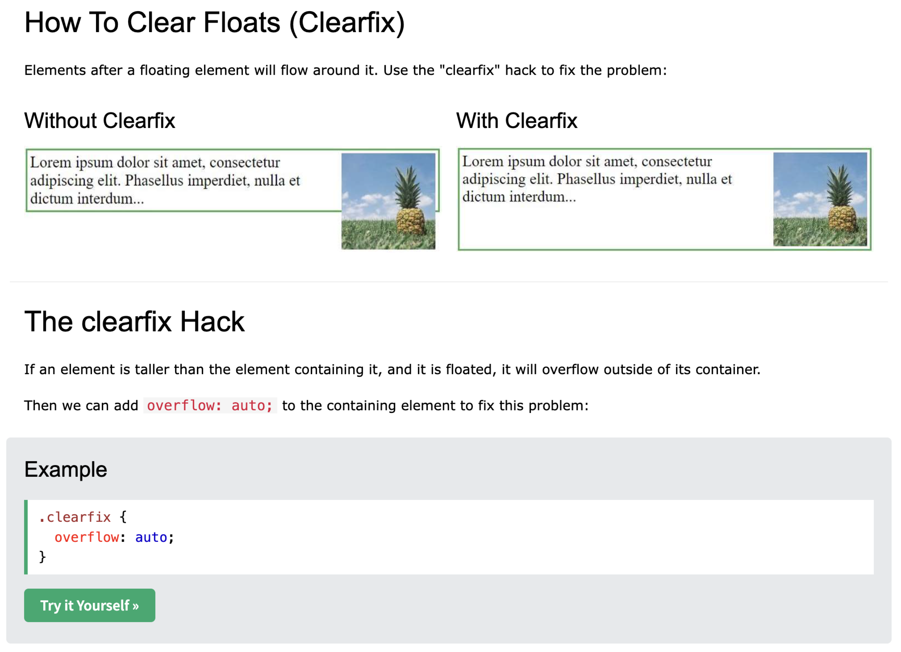
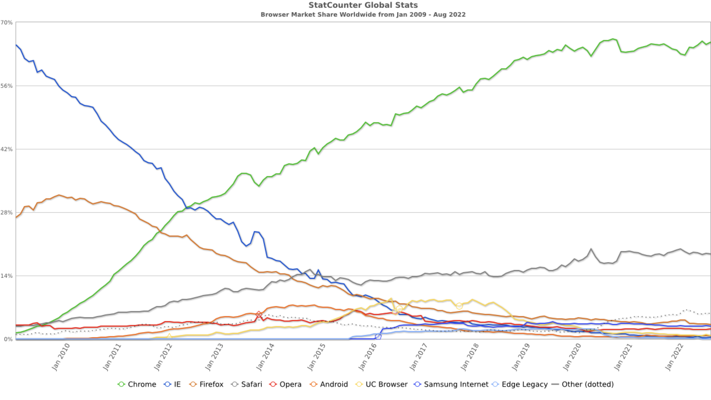
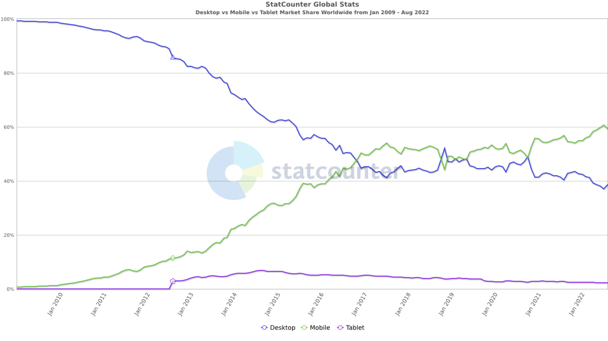

## State of the Web

Joe Duncko 2023-01-23

---

## Last class we learned

- How to build forms with HTML
- We built our first form

---

## Thanks for making assignment 1 go well!

No one needed two iterations, nice!

Grades will be in BlackBoard Wednesday

If you got a LGTM you have a 100% A, otherwise your grade was conveyed in the chat.

---

## Assignment 2 is due Wednesday by class time

### Any questions?

---

# Some last form things

---

## The Reset button

This button automatically clears all form fields.

```html
<button type="reset">Reset</button>
```

---

## Textareas

Works differently than the other text inputs... for historical reasons.

```html
<label for="description">Description</label>
<textarea id="description" name="description"></textarea>
```

Can optionally add placeholder text and specify the size in rows and columns.

```html
<label for="description">Description</label>
<textarea id="description" name="description" rows="5" cols="33">
	Can pre-fill in a description here.
</textarea>
```

---

## On checkboxes and radio buttons

<form>
  <fieldset>
    <legend>Choose your favorite monster</legend>

    <input type="radio" id="kraken" name="monster" value="K">
    <label for="kraken">Kraken</label><br>

    <input type="radio" id="sasquatch" name="monster" value="S">
    <label for="sasquatch">Sasquatch</label><br>

    <input type="radio" id="mothman" name="monster" value="M" />
    <label for="mothman">Mothman</label>

  </fieldset>
</form>

```html
<form>
  <fieldset>
    <legend>Choose your favorite monster</legend>

    <input type="radio" id="kraken" name="monster" value="K" />
    <label for="kraken">Kraken</label>

    <input type="radio" id="sasquatch" name="monster" value="S" />
    <label for="sasquatch">Sasquatch</label>

    <input type="radio" id="mothman" name="monster" value="M" />
    <label for="mothman">Mothman</label>
  </fieldset>
</form>
```

<form>
  <fieldset>
    <legend>What monsters do you like?</legend>

    <input type="checkbox" id="kraken" name="monster" value="K">
    <label for="kraken">Kraken</label>

    <input type="checkbox" id="sasquatch" name="monster" value="S">
    <label for="sasquatch">Sasquatch</label>

    <input type="checkbox" id="mothman" name="monster" value="M" />
    <label for="mothman">Mothman</label>

  </fieldset>
</form>

```html
<form>
  <fieldset>
    <legend>What monsters do you like?</legend>

    <input type="checkbox" id="kraken" name="monster" value="K" />
    <label for="kraken">Kraken</label>

    <input type="checkbox" id="sasquatch" name="monster" value="S" />
    <label for="sasquatch">Sasquatch</label>

    <input type="checkbox" id="mothman" name="monster" value="M" />
    <label for="mothman">Mothman</label>
  </fieldset>
</form>
```

For the assignment, you just need one `checkbox`. Because there's only one, you don't need a `fieldset`

<input type="checkbox" id="sasquatch" name="monster" value="S"><label for="sasquatch">Sasquatch</label>

```html
<input type="checkbox" id="sasquatch" name="monster" value="S" />
<label for="sasquatch">Sasquatch</label>
```

---

# The State of the Web

---

# The Web in 2014

### The year this class's book was written

- Windows 8.1 released
- iPhone 6 released
- Chrome hit 50% market share, was transitioning from WebKit to Blink
- Mobile was only ~20% of web traffic
- Mashable called 2013 the Year of Responsive Web Design
- FF + Chrome recently adopted monthly release cycles

---

## HTML 5 Spec

### Published in Oct 2015

- Created by the **W3C** + **WHATWG** (not to be confused with W3 Schools)
- First draft in 2007
- 2012 "Candidate recommendation"
- 2014 "Recommendation"
- A "Living Standard" - "Forward compatible"

---

## Will browser vendors and devs actually adopt the HTML5 spec?

### - The book's author, probably

---

## The Outlook from 2014

### Kinda bleak

- Content Management Systems (CMSs) like Wordpress + WYSIWYG editors were mostly non-standards compliant ("easy" to make non-standard sites)
- To support old browsers, everyone was doing weird hackery
- Mobile browsers were sketchy
- People were targeting different browsers in weird ways
- People were holding on to Flash for dear life
- Businesses were holding on to Windows XP and IE for dear life

---

## Good news

- Browsers were at implementing HTML5 specs behind flags long before 2014
- Browsers recently started updating monthly
- People were actually starting to care about the performance of their browser
- Sites like CanIUse were helping developers become more familiar with new features

---

## Why care about standards at all?

- Write once, work everywhere
  - Progressive enhancement
- Less magic tricks (like clearfixes)
- Less nonstandard layout (like using tables for menus and images for buttons)
- No more proprietary, insecure plugins like Flash, Java Applets, and ActiveX
- "Semantic web"
  - Accessibility (will talk about later)
  - Search Engine Optimization (SEO) (will talk about later)

---



---

# Today

- Internet Explorer is dead
- Chrome's Blink engine is dominant
- Mobile is 70% of traffic
- Standards are followed by everyone except Safari
- Progressive enhancement + mobile-first responsive design is normal
- Javascript is finishing up a similar transition as HTML5

---



---



---

## Other trends

- Proliferation of frameworks + tools
  - Very complicated and fast moving build systems and technologies, will hopefully simplify over next couple years
- Web-based applications (like Figma)
- Progressive Web Apps (that can take advantage of native capabilities like cameras, GPS, game controllers, gyro, etc)
- HTML+CSS+JS based desktop apps via Electron (Discord, Slack, Spotify, VSCode, etc)
- HTML+CSS+JS based mobile apps via React Native, Ionic, etc (Facebook, AirBnB, Discord, etc)

---

## Let's Explore some Source Code!

All web sites send their entire source code over the wire for web browsers to interpret - they aren't binaries!

Many websites use tools to "uglify" their code to make it smaller as well as harder to read.

Most web sites leave evidence of what was used to build them.

How to access the Source of a site:

- Right click > View Page Source

Let's Compare source of different types of sites like hand-spun, Wordpress, server side rendered, minified, Facebook, Shopify, etc

- Youngstown.dev - hand spun
- Code Youngstown - NextJS / React
- New York Times
- MDN
- W3 Schools
- Facebook
- Google
- YSU - Drupal

---

# Let's explore the Inspector!

### AKA Developer Tools

All browsers have a set of developer tools - I prefer Chrome's though.

Safari's needs turned on in Options.

How to access the Inspector:

- Windows: Control + Shift + C
- Mac: Option + Command + C
- Right Click - Inspect Element
- Chrome: Settings > More Tools > Developer Tools

---

## What can I do with the inspector?

- See + change elements locally, in real time
- View network transmissions
- View and type in the JavaScript console
- Simulate mobile views
- Simulate slow connections and CPU speed
- Measure website performance
- Stepper Debugger
- View sources
- See Cookies, cache, etc
