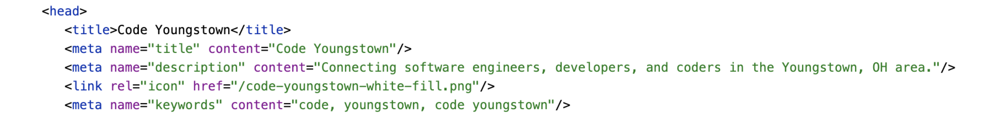

# The Semantic Web

Joe Duncko 2022-01-30

---

## Assignment 2 was due by class last Wednesday

### Iterations are due by class this Wednesday

### Questions?

---

## Some clarifications:

- Assignments are due BY class time. Not during. Not after. BY! As in BEFORE class starts.
- I un-submit the assignment if you don’t have a 100% A on it to give you the opportunity to re-submit an iteration.

---

## New policy:

# Submissions must now pass the w3 validator to qualify for iterations

## 90%+ of issues on the last assignment were caught by the validator

It's so easy and saves us both time, please validate your assignment before you turn it in!

If you are confused by a validation issue, ask in the `#general` chat on Discord

---

# Let's play with the validator a bit

---

# Let's look at the assignment 2 tester I made

---

## Let's talk input types

- `text` is default
- Why `employees` should be type `number`
- Why `zip` should NOT be type `number`
- Why `phone` should be type `tel` and not number
- Why `tel` is weird
- `type="url"`
- `type="email"

---

## Last class we covered

- Textareas
- Radio selects
- Checkboxes
- How the web changed from 2014 to today
- Viewing page sources
- The Inspector

---

## What is the Semantic Web?

### Web sites that are readable by...

- Humans
- Computers
- Web scrapers
- Search engines
- Screen readers

---

## How Google works





---

# SEO is a whole industry

---

## Semantic vs non-semantic web pages


---

## Examples of things you can do to make your site more Semantic

- Include appropriate meta tags
- Use the `nav`, `main`, `header`, `footer`, `section`, `article`, and `aside` tags when appropriate
- Be intentional with h1-h6 headers
- Use image alt text and/or captions
- Use good button text
- Use good link descriptions (don't just use the link url itself)
- Use good titles on interactive elements when necessary
- Use tables for tabular data, and include table headers
- Use good labels for inputs
- Don't use anchors for buttons and vice versa
- Use `ul` or `ol` and `li`s for lists
- Use `p` tags only for paragraphs
- Do not use pictures instead of parsable text
- - more...

---

## Examples of things you can do to make your site more Accessible

### Oh hey, it's the same list

- Include appropriate meta tags
- Use the `nav`, `main`, `header`, `footer`, `section`, `article`, and `aside` tags when appropriate
- Be intentional with h1-h6 headers
- Use image alt text and/or captions
- Use good button text
- Use good link descriptions (don't just use the link url itself)
- Use good titles on interactive elements when necessary
- Use tables for tabular data, and include table headers
- Use good labels for inputs
- Don't use anchors for buttons and vice versa
- Use `ul` or `ol` and `li`s for lists
- Use `p` tags only for paragraphs
- Do not use pictures instead of parsable text
- - more...

---

## More examples of making your site Accessible

- Use good color contrast (browser defaults are a good start!)
- Keep column widths short
- Limit animations
- Use appropriately sized fonts (browser defaults are a good start!)
- Use appropriate spacing between elements (browser defaults are a good start!)
- - way more!

---

## Accessibility and Semantics are a spectrum

You need to take into account what you are trying to convey and to whom to decide how much time you need to spend on semantics and accessibility

---

# Dealing with multiple files

---

## Pages

- Most web servers are configured to serve `index.html` when the file name is not specified in a folder
  - This is why you must have at least one `index.html` in the base folder of your Replit
- You can make other html files and link between them
  - TIP: DO NOT put capital letters or spaces in html file names - if they are multiple words, hyphenate them (ie `about-me.html`)

```html
<a href="about.html">About</a>
```

```html
<a href="about.html" title="To the about page">About</a>
```

---

## Images

- Alt tags are important for SEO and accessibility
- No closing tag
- I usually put my images in a `images` folder

```html

```

---

## Favicons

- Shows in tabs, as well as when you add web sites to your desktop
- Can be mostly any PNG in modern browsers
- If you care, you can specify different sizes for different very specific uses and platforms (android vs ios vs ipad vs windows desktop etc)


```html
<head>
  <link rel="icon" href="/images/code-youngstown-favicon.png" />
</head>
```

---

## Relative vs Absolute file locations

### Absolute

- `http://www.mysite.com`
- `http://www.mysite.com/graphics/image.png`
- `http://www.mysite.com/help/articles/how-do-i-set-up-a-webpage.html

### Relative to current url

- `index.html`
- `pictures/tahiti-vacation/tahiti.html`
- Going up a directory: `../../index.html`

### Relative to base url

These are what I prefer, I find they reduce mistakes

- `/graphics/image.png`
- `/help/articles/how-do-i-set-up-a-webpage.html`

https://www.coffeecup.com/help/articles/absolute-vs-relative-pathslinks/
