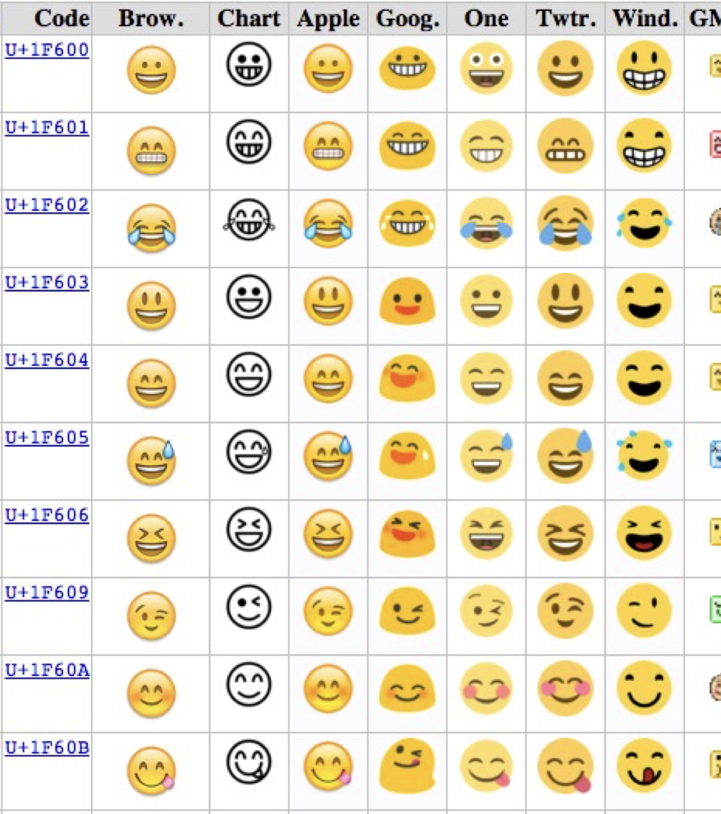

# Unicode & File Types

Joe Duncko 2023-02-06

---

## Assignment 2 iteration 2 was due by class today

### Questions?

---

## Assignment 3 was due by class today

### Questions?

---

## HTML Quiz is due Monday Feb 13th by class time

- 25 random questions selected from a 60 question pool
- Questions and answers appear in random order each attempt
- Unlimited time
- Unlimited retries
- Top score between retries
- Let me know if you see any typos
- Use any resources you'd like (including the internet!!!)

### Questions?

---

# Unicode

Joe Duncko 2022-01-30

---

## About Unicode

- Unicode is a character encoding
- It includes most languages' letters 漢字, plus emojis 😀, wingdings ✌︎, braille ⠓, etc - over 130k chars
- Supports right-to-left languages as well
- There are many character encodings, but for web dev you'll always use Unicode, specifically UTF-8

---

Wrong encodings mean you'll see **□** and   symbols

---

## Using Unicode in HTML

3 Ways:

- Use the characters themselves
  - ie, >
- Using the character's numeric reference
  - ie, &#62;
- Using the character's entity reference
  - ie, &gt;

---

&lt; span &gt; &lt; /span &gt;

\<span\>\</span\>

## In practice

- Always use character reference unless you NEED to use entity reference
- That will only happen with & < > and " , because those characters are also used in html
- You can also use the `\` symbol to "escape", ie stop the browser from identifying the next character as part of code
- Let's see some examples...

---

## Fonts

- Not all fonts support all encodings or characters
- Your browser will try to use fallbacks - for example, it'll simulate a **bold** font if the current font is missing a bold version - but they don't always work

---

## ASCII

ASCII is an old encoding that includes only basic characters, you may have heard of "ASCII Art"

---

## Ligatures

A typographic ligature combines two letters into a single glyph

---

# File types

---

# Images

---

## JPG / JPEG

- Raster / pixel based
- Lossy - can choose how much loss
- No alpha layer / transparency

---

## PNG

- Raster / pixel based
- Lossless
- Can have alpha layer / transparency

---

---

## GIF

- Raster / pixel based
- Lossy
- Can be animated
- No alpha layer / transparency
- Usually large in file size

---

## SVG

- Vector
- Can be written by a human
- Small file size
- Lossless
- Can be infinitely zoomed
- Human readable - can contain html
- Can be controlled with javascript, like html
- Background is always transparent

https://www.w3schools.com/graphics/svg_intro.asp

---

## WebP

- New image format by Google
- Raster
- Can be lossy or lossless
- Can be animated
- Supported by all browsers but IE
- Fun fact: Giphy is mostly WebP

https://giphy.com/

---

## Concerns with images

- Resolution
- Big enough to look good on all devices
- Small enough to be efficient
- File size
- Layout shift
- Alt text

---

# Video

## Concerns with video

- Format/CODEC and container type
  - Some browsers support different formats, better now though
- Progressive loading (vs loading whole video at once before playing)
- Resolution/quality switching
- Streaming
- Bandwidth
- Hardware acceleration
- Can't autoplay (without weird browser hackery) anymore

---

# Audio

## Concerns with audio

- File type
- Can't autoplay anymore

---

# Feeds

## RSS vs Atom Feeds

- Both are written in XML
- RSS is older and most used
- Atom is newer and rarer
- Feed reader clients look at feed files and let you know if there's something new
- Often used for news
- RIP Google Reader

https://xkcd.com/atom.xml
