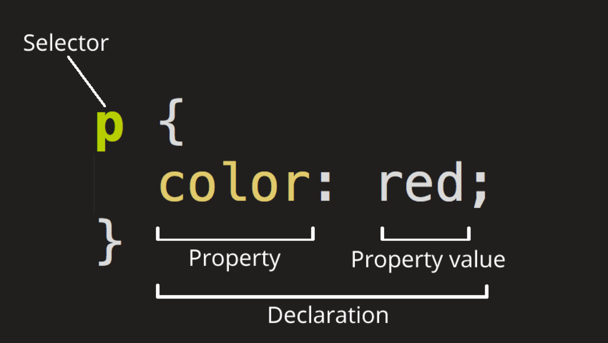
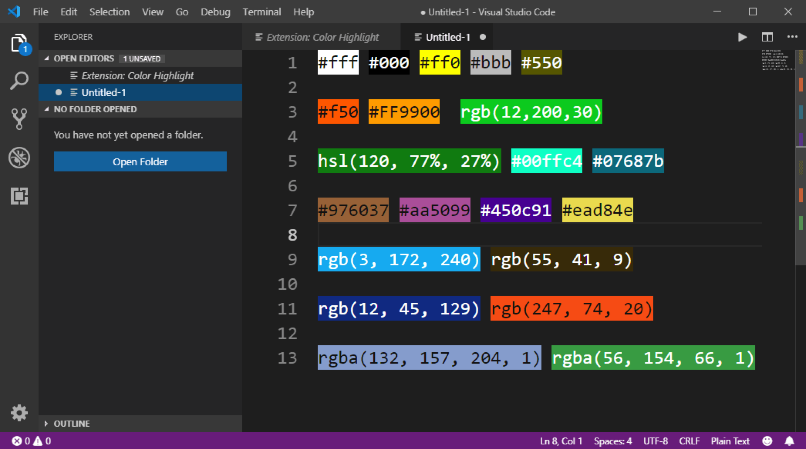
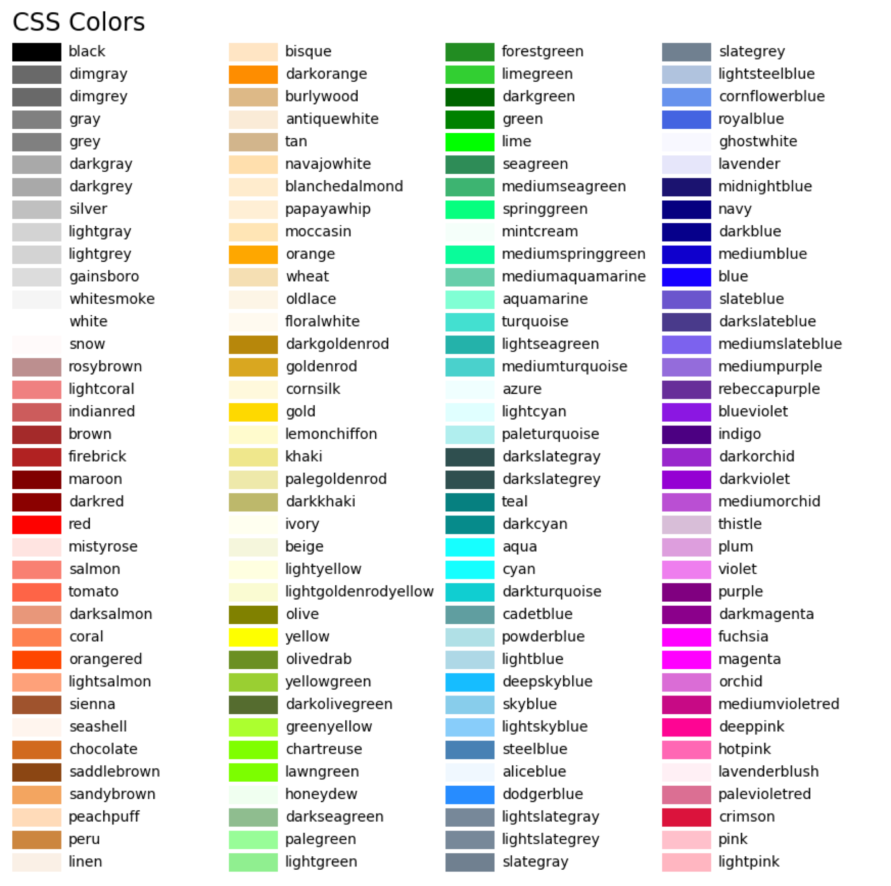

# Intro to CSS

Joe Duncko 2023-02-08

---

## Assignment 2 grades are in the grade book

Please check your grade and let me know if anything looks weird.

---

## Assignment 3 feedback is in the works

Expect feedback within the next couple of days.

---

## HTML Quiz is due Monday by class time

---

## Last class we covered

- Unicode
- Compared different image, video, and audio file types

---

## Let's put some videos and audio on a page

```html
<video controls src="Big_Buck_Bunny_360_10s_1MB.mp4"></video>
<audio controls src="orchestra.mp3"></audio>
```

https://replit.com/@JoeDuncko/2023-02-07-Videos-and-audio#index.html

---

# Intro to CSS

---

### Can be added 3 ways

- Inline style sheet
  - On an HTML element, like `style="property:value; property:value;"`
- Internal style sheet
  - <style></style> tag in the HTML `<head>`
- External style sheet
  - `.css` file `link`ed at the top of the page

---

## Anatomy of a CSS Rule



---

## Selectors

### CSS Selectors

- Element (`whatever`)
- Class (`.whatever`)
  - You'll mostly use these in real life
- ID (`#whatever`)

### Grouped CSS Selectors

Can write common rules for multiple elements using a comma

```css
.something,
.something-else {
  property: value;
}
```

### Nested CSS Selectors

Can specify that rules only take place if elements are nested in a specific order using a space between selectors (aka parent / child or "descendant))

```css
.something .something-else {
  property: value;
}
```

Can even specify that elements must be directly nested (aka direct parent / direct child) with a `>`

```css
.something > .something-else {
  property: value;
}
```

Can even use `*` to skip a nesting level

```css
.something > * > .something-else {
  property: value;
}
```

### Combined CSS Selectors

Can specify that rules only take place if elements have multiple selectors with NO spaces

```css
something.something-else {
  property: value;
}
```

### Psudoclasses

Some elements have Psudoclasses that can be addressed with a colon (`:`)

```css
.link:visited {
  property: value;
}

.link:hover {
  property: value;
}

p:first-letter {
  property: value;
}
```

---

### Colors in HTML + CSS

- Hex `#222222` `#222`
  - Every two characters represents the "amount" of red, green, or blue
  - 22 red
  - 22 green
  - 22 blue
- RGB `rgb(256, 256, 256)`
- RGBA `rgba(256, 256, 256, 50)`
- HSL
- Named colors





---

### Let's check out a color picker

---

## Sizing in HTML

- Absolute sizing
  - Pixels - "px"
  - - more...
- Font-relative sizing
  - Current font size (relative to 1) - "em"
  - Root font size (relative to 1) - "rem"
  - - more...
- Viewport-relative sizing
  - View widths (out of 100) - "vw"
  - View height (out of 100) - "vh"
  - - more...

Fun fact: default font size is 16px in most browsers

---

## Let's try out setting the color and size of different things using different selectors!
