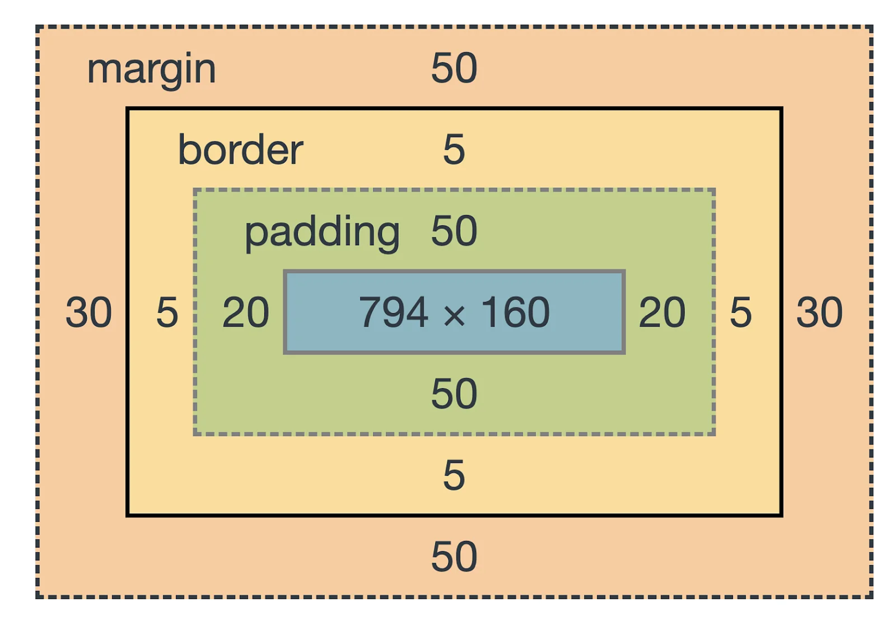

# Most important CSS Properties

Joe Duncko 2023-02-13

---

# Assignment 3 iterations due Wednesday by class time

# Run every page through the w3 validator individually!

# Fix the warnings!

---

## Last class we covered

- The anatomy of a CSS rule
- Where CSS goes
- CSS selectors
- Colors in CSS
- Sizing in CSS
- Tried using our first selectors, colors, and sizings

---

## Most important CSS properties

- color
- font
- width / height
- padding / margin
- border
- background
- text-align
- overflow

---

## Color

Changes text color

---

## Font

Includes...

- `font` (a shortcut)
- `font-family`
- `font-size`
- `font-style`
- `font-weight`
- - more

---

## The CSS Box Model

---

## Width / Height

- `width`
- `min-width`
- `max-width`
- `height`
- `min-height`
- `max-height`

Great for mobile responsiveness!

Can also specify width/height directly on images, prevents layout shift

---

## Padding / Margin

`padding`

- `padding-top`
- `padding-right`
- `padding-bottom`
- `padding-left`

`margin`

- `margin-top`
- `margin-right`
- `margin-bottom`
- `margin-left`

- Shortcut to set multiple values quickly:

  - `property: all`
  - `property: top right bottom left`
  - `property: top/bottom left/right`

- `Margin: auto` can center an element
  - But use Flexbox instead

---

## Border

- `border` (a shortcut)
- `border-top`
- `border-right`
- `border-bottom`
- `border-left`
- `border-style`
- `border-color`
- `border-width`
- `border-radius`
- - more

---

## Background

- `background` (a shortcut)
- `background-color`
- `background-image`
- `background-size` (includes the popular "cover")
- `background-position`
- `background-repeat`

---

## Text-align

Possible values:

- `center`
- `left`
- `right`

---

## Overflow

- Determines how content in a div should overflow outside of that div
- Controls whether or not a `div` should be scrollable
- `overflow` /` overflow-x` / `overflow-y`
  - "visible"
  - "hidden"
  - "auto"
  - "scroll"

---

# Assignment 4 will be posted tonight

## Due Monday by class time
